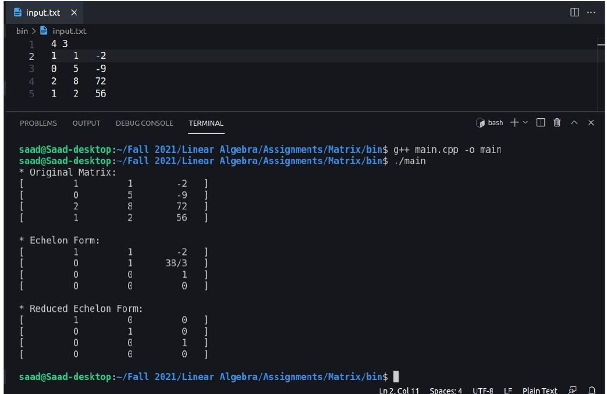

# Echelon Form Calculator

A program to find the echelon and reduced echelon
form of a matrix of any order.

## Organization

The project consists of following folders:
1. `include/` – to store the custom header files.
1. `lib/` – to store the definitions of custom header files.

The program consists of following classes:
1. `Fraction` - mathematical fractions.
1. `Row` - matrix rows.
1. `Matrix` - a matrix.


## Run Locally

Clone the project

```bash
  git clone git@github.com:saad0510/echelon-matrix-calculator.git
```

Go to the project directory

```bash
  cd echelon-matrix-calculator
```

Open the `input.txt` file with your favorite editor 
and write:
    - the order of the matrix in the first line.
    - each row in a separate new line
    
Generate object files

```bash
  g++ -o lib/*
```

Compile && run the program

```bash
  g++ main.cpp *.o -o main.out
  ./main.out
```


## Screenshots




## Last Updated

_December, 2021_
## Authors

- github : [@saad0510](https://www.github.com/saad0510)
- email  : k200161@nu.edu.pk or ayyansaad46@gmail.com

